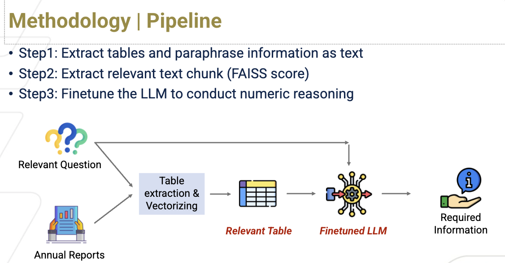

# CSE8803_DLT_Project
This repository contains all the relevant data and code files for our DLT Project.

 
 
 

 

 **Abstract**
 
 Financial reports offer critical insights into a company’s operations, yet their
extensive length—typically spanning 30-40 pages—poses challenges for swift
decision-making in dynamic markets. To address this, we leveraged fine-tuned
Language Models (LLMs) to distill key indicators and operational metrics from
these reports. We devised a method to locate critical data, and leverage the FinQA
dataset to fine-tune both Llama 2 7B and T5 models for customized question answering. We achieved 65% accuracy on final numerical answer, a competitive
accuracy in numerical reasoning and calculation.

 
 
 **Methodology**
 
  
Figure 1: LLMs to do Numerical Reasoning on annual reports (Pipeline)

 

 **Conclusion**
 
 As part of this exercise we have been able to engineer a robust approach for numerical question
answering from PDF reports by leveraging advanced natural language processing techniques, based
on T5, Llama-2 and Langchain. Despite the overall success, certain nuances required careful consideration. Parsing non-conventional tables presented challenges, as the approach encountered limitations in handling unconventional table structures commonly found in complex reports. Additionally, errors in the table-to-text serialization process posed another obstacle, demanding a refined post-processing pipeline to enhance the accuracy of the answers generated. Furthermore, it was observed that certain aspects of question-answering with large language models (LLMs), exhibited subpar performance,necessitating ongoing efforts to address and improve model performance.
In conclusion, while our approach demonstrated commendable results in numerical question answering from PDF reports, continual refinement is essential to overcome challenges related to non-conventional tables, serialization errors, and performance nuances associated with large language
models in question-answering tasks. These insights guide our ongoing efforts to enhance the robustness and applicability of our approach.

 
 
**Important Links:**

- [Presentation Slides](https://gtvault-my.sharepoint.com/:p:/g/personal/adhiman9_gatech_edu/EX7EfJgIK5ROkyiFEgGn9TkBGI-FW4iW_FJjTux2hhrAVA?e=roqboM)
- [FinQA Dataset](https://github.com/czyssrs/FinQA/tree/main/code)

